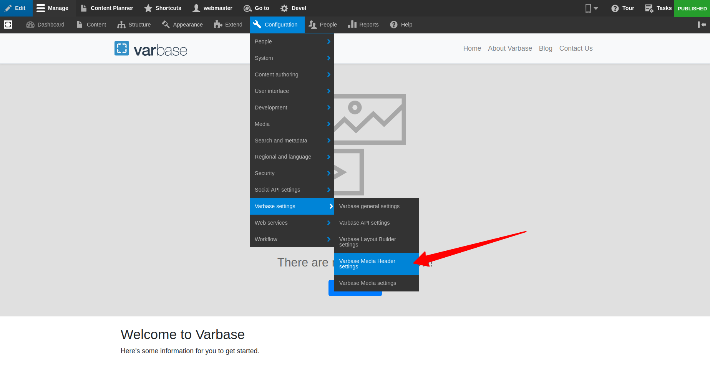
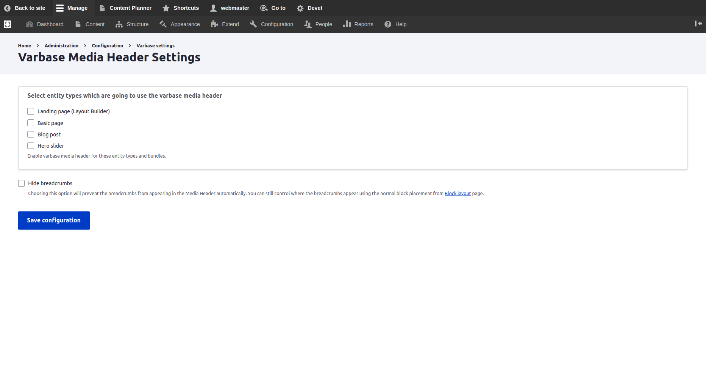

# Configuring Varbase Media Header

Having a universal media header style on top of web pages.

Site builders can activate that for content types.



## Activate Media Header Content Types

### **Varbase Media Header Settings**

* Navigate to **Configuration**  \ **Varbase** **settings**  \ _**Varbase Media Header settings**_ 

* Landing on the _"/admin/config/varbase/varbase-media-header"_  admin link. List of content types are listed with activated or not activated media header.

* Select entity types which are going to use the varbase media header. To enable varbase media header for these selected entity types and bundles.
* Check **Hide breadcrumbs** to prevent the breadcrumbs from appearing in the Media Header automatically. To control where the breadcrumbs appear using the normal block placement from **Block layout** page.
* Press the **Save Configuration** submit button to activate new configs for the selected content types.


This will add two new fields to each selected content type:

* **Main media** \(field\_media\): to store the media for the header
* **Page header style** \(field\_page\_header\_style\):

  Which stores the choice of header as :

* Standard \(standard\)
* Media Header \(media\_header\)

For sure more custom page header styles could be added to the filed. But that will need a custom template logic to follow with that.


* Navigate to **Structure** \ **Block layout** and place the **Varbase Media Header block**

  \(usually at the top of the top bar\) 

* For each content type choose `'main media'`.
* For the Media view mode choose `'Media header'` unless you want a particular view mode, but `'Media header'` will ensure the module template will be used and give you control

  of the display settings. 

