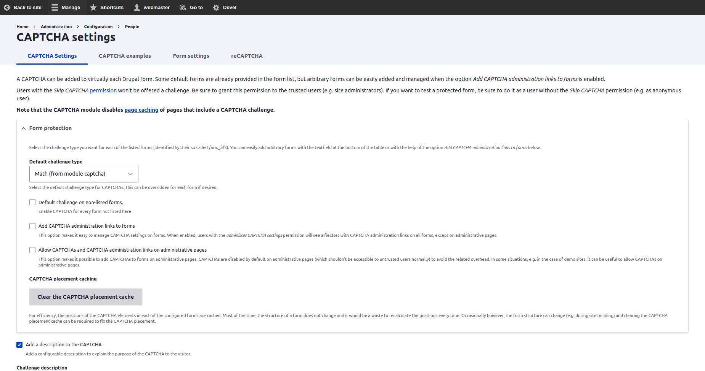
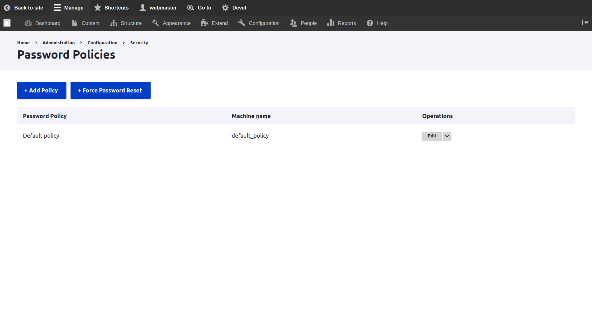
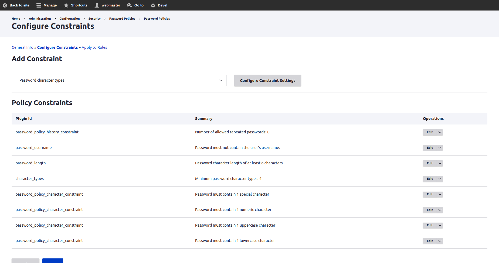
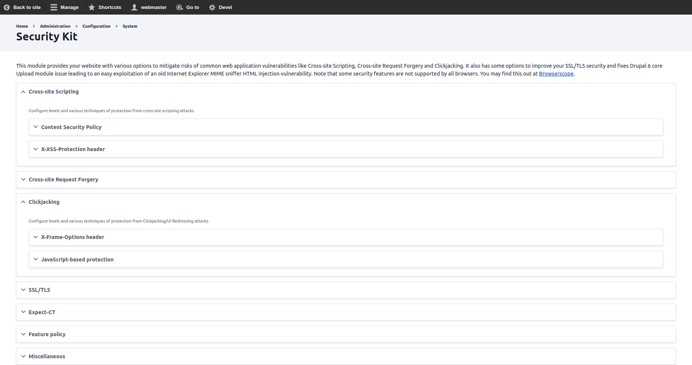

# Configuring Security Features

Varbase bundles several security-related enhancements for compliant and secure websites.

**Varbase Security** module assembles general security configurations, with password policy, username enumeration prevention, security kit and review.



## CAPTCHA and reCAPTCHA on Forms

To configure the CAPTCHA methods in your site, navigate to:  
**Administration** \ **Configuration** \ **People** \ _**CAPTCHA module settings**_

A CAPTCHA can be added to virtually each form in your website. The configuration page allows you to configure settings such as:

* Default CAPTCHA method
* Challenge description
* Persistence options. Whether you want the CAPTCHA challenge to appear every time or to skip after successful challenge
* Enable statistics
* Log wrong responses

### Enable reCAPTCHA

To enable reCAPTCHA, you'll need a Site key and Secret key for your site. These are provided from Google's reCAPTCHA administration page.

1. Navigate to **reCAPTCHA** tab in your site \(**Administration** \ **Configuration** \ **People** \ **CAPTCHA module settings** _**\ reCAPTCHA**_
2. Obtain a `Site key` and and a `Secret key` from [https://www.google.com/recaptcha/admin](https://www.google.com/recaptcha/admin), and enter it the reCAPTCHA configuration page
3. Change the **Widget settings** to match your site's theme

### Adding CAPTCHA Challenge to a Specific Form 

1. Navigate to **Form settings** tab in your site \(**Administration** \ **Configuration** \ **People** \ **CAPTCHA module settings** _**\ Form settings**_
2. Click on "**+ Add captcha point**" to add a new form to the list
3. Enter the form ID \(e.g. `user_register_form`\) and choose the enabled CAPTCHA type on it, or keep it as the default challenge configured for the site


You can also add a CAPTCHA challenge on Webforms individually from the Webform building page, by adding a new CAPTCHA element to the form.

Adding a CAPTCHA challenge to a Webform this way will not list the form in the Form settings page.


\_\_

## Honeypot Spam Deterring on Forms

Honeypot uses both the honeypot and timestamp methods of deterring spam bots from completing forms on your site. These methods are effective against many spam bots, and are not as intrusive as CAPTCHAs or other methods which punish the user.

The module currently supports enabling for all forms on the site, or particular forms like user registration or password reset forms, webforms, contact forms, node forms, and comment forms.

To configure the Honeypot in your site, navigate to:  
**Administration** \ **Configuration** \ **Content authoring** \ _**Honeypot configuration**_

\_\_

The configuration page allows you to configure settings such as:

* Protect all forms with Honeypot
* Log blocked form submissions
* Honeypot element name
* Honeypot time limit
* Honeypot Enabled Forms


You can also enable Honeypot spam deterring mechanism on Webforms individually from the Webform configuration page.


## Password Policies

To configure the Password Policies in your site, navigate to:  
**Administration** \ **Configuration** \ **Security** \ _**Password Policy**_

Varbase ships with a default password policy to provide a way to enforce restrictions on user passwords by defining password policies.

You can add multiple policies __each policy is assigned to a specific role __, or edit the default provided policy 

A password policy can be defined with a set of constraints which must be met before a user password change will be accepted. Each constraint has a parameter allowing for the minimum number of valid conditions which must be met before the constraint is satisfied.

> **Example:** an uppercase constraint \(with a parameter of 2\) and a digit constraint \(with a parameter of 4\) means that a user password must have at least 2 uppercase letters and at least 4 digits for it to be accepted.

## Security Kit for XSS, CSRF, SSL/TLS, Expect-CT, and More

To configure the Security Kit module in your site, navigate to:  
**Administration** \ **Configuration** \ **System** \ _**Security Kit settings**_

The configuration page allows you to configure settings to tighten your website's security regarding:

* **Cross-site Scripting \(XSS\)**
  * **Content Security Policy \(CSP\)**: Content Security Policy is a policy framework that allows to specify trustworthy sources of content and to restrict its capabilities. You may read more about it at [Mozilla Wiki](https://wiki.mozilla.org/Security/CSP).
  * **X-XSS-Protection header**: `X-XSS-Protection` HTTP response header controls Microsoft Internet Explorer, Google Chrome and Apple Safari internal XSS filters.
* **Cross-site Request Forgery \(CSRF\):** Configure levels and various techniques of protection from cross-site request forgery attacks.
* **Clickjacking**
  * **X-Frame-Options header:** Configure the `X-Frame-Options` HTTP header.
  * **JavaScript-based protection:** Warning: With this enabled, the site will not work at all for users who have JavaScript disabled \(e.g. users running the popular [NoScript](https://noscript.net/) browser extension, if they haven't whitelisted your site\).
* **SSL/TLS:** Configure various techniques to improve security of SSL/TLS
* **Expect-CT:** Configure the `Expect-CT` header which allows sites to opt in to reporting and/or enforcement of Certificate Transparency requirements. See [Mozilla's developer documentation](https://developer.mozilla.org/en-US/docs/Web/HTTP/Headers/Expect-CT).
* **Feature policy:** Allows configuration of the `Feature-Policy` header to selectively enable, disable, and modify the behavior of certain APIs and web features in the browser. See [Google's developer documentation](https://developers.google.com/web/updates/2018/06/feature-policy).
* **Miscellaneous:** Configure miscellaneous unsorted security enhancements such as:
  * `From-Origin` HTTP response header
  * `Referrer-Policy` HTTP response header

All necessary documentation and examples of usage are on settings page.

_\*\*\*\*_

_\*\*\*\*_

