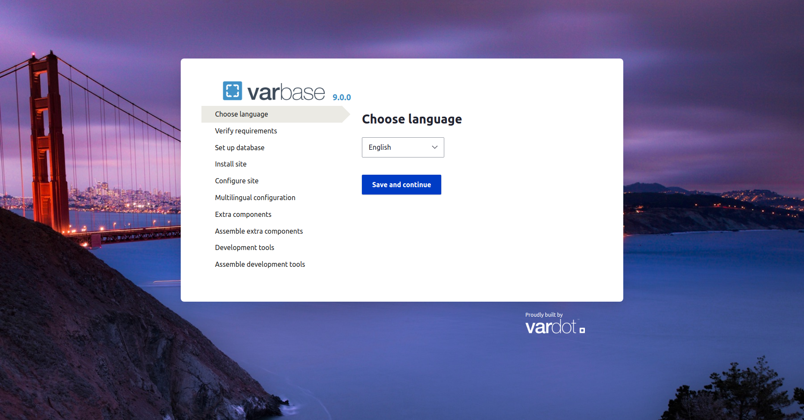
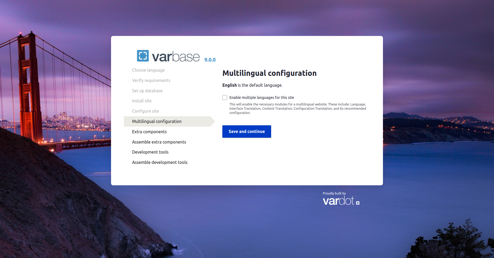

# Varbase Internationalization

Languages, and translation support.

Enables the necessary modules for a multilingual website. These include: **Language**, **Interface Translation**, **Content Translation**, **Configuration Translation**, and its recommended configuration.

## Varbase Internationalization Module


Varbase internationalization features are bundled through the **Varbase Internationalization** module as part of the **Varbase Core** module.  
GitHub: [https://github.com/Vardot/varbase\_core](https://github.com/Vardot/varbase_core)  
Drupal.org: [https://www.drupal.org/project/varbase\_core](https://www.drupal.org/project/varbase_core) 

After building a project using the `varbase-project` template, you can see the code of the **Varbase Internationalization** module in:


```text
project_directory
|-- docroot
    |-- modules
        |-- contrib
            |-- varbase_core
                |-- contrib
                    |-- modules
                        |-- varbase_internationalization
```

Brings in the following core and contributed modules to your site:

<table>
  <thead>
    <tr>
      <th style="text-align:left">Module</th>
      <th style="text-align:left">Purpose</th>
    </tr>
  </thead>
  <tbody>
    <tr>
      <td style="text-align:left">
        <p><b>Language</b>
        </p>
        <p><em>(in Drupal core)</em>
        </p>
      </td>
      <td style="text-align:left">Allows users to configure available languages.</td>
    </tr>
    <tr>
      <td style="text-align:left">
        <p><b>Interface Translation</b>
        </p>
        <p><em>(in Drupal core)</em>
        </p>
      </td>
      <td style="text-align:left">Translates the built-in user interface.</td>
    </tr>
    <tr>
      <td style="text-align:left">
        <p><b>Configuration Translation</b>
        </p>
        <p><em>(in Drupal core)</em>
        </p>
      </td>
      <td style="text-align:left">Allows users to translate configuration text.</td>
    </tr>
    <tr>
      <td style="text-align:left">
        <p><b>Content Translation</b>
        </p>
        <p><em>(in Drupal core)</em>
        </p>
      </td>
      <td style="text-align:left">Allows users to translate content.</td>
    </tr>
  </tbody>
</table>

## Enable Multiple Languages on Varbase Installation

Choose the language of instillation and default website language on the first step of installing Varbase



Varbase gave the option of enabling a multiple language options on the multilingual configuration installation step.



This will enable the necessary modules for a multilingual website. These include: Language, Interface Translation, Content Translation, Configuration Translation, and its recommended configuration.



Enabling multiple languages for the site right from the installation step is the best option for multilingual websites.

Configurations which are related to languages will take affect on install. And after the install of any extra or external components.



In case of not selecting the option on install. some issues will start to show up.

**Example:**  The language field at the form display and field display will not be placed in the default Varbase standard order and position.



