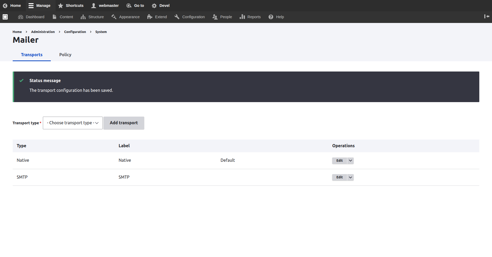

# Configure Symfony Mailer


Have a look at the official documentation for the **Symfony Mailer** module

See [https://www.drupal.org/docs/contributed-modules/symfony-mailer-0](https://www.drupal.org/docs/contributed-modules/symfony-mailer-0)


## Add an SMTP Transport Service

Navigate to **Administration \ Configuration \ System \ **_**Mailer**_

To see the list of mailer transports.

* Select _SMTP_ from the list of Transport types, and click o the Add transport button
* Fill in the Lebel for this SMTP service
* Fill in the User name for the  SMTP service. It could be the same email sender created in the SMTP service provider
* Provide the password to log in with it
* Provide the Hostname public SMTP domain provider
* Use the right SMTP port, which the provider recommends to use

Press the Save submit button to save the SMTP transport

A message of _"The transport configuration has been saved."_ will show up and the page will be redirected back to the Mailer transports configuration page.

Set the STMP transport as the default transport sender for emails, by clicking on "Set as Default" from the operations list for the SMTP transport.

