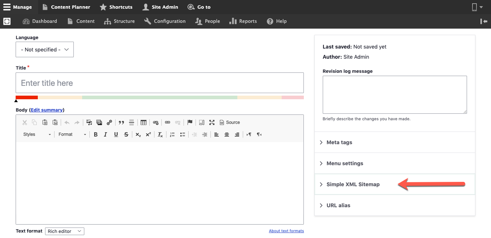

# Prevent a Single Content From Being Indexed

This article will walk you through how to exclude a specific piece of content from being indexed in search engines. To achieve this, you'll need to:

1. Set `noindex` value for `robots` meta tag when adding or editing the content
2. Prevent the content from being added to the XML sitemap

Follow these steps to achieve this:

1. Navigate to any content for example filter the content page with Basic page
2. Edit a certain basic page
3. Look for “SIMPLE XML SITEMAP” and click the item that can be located in the sidebar \(the node settings\)

 3. You will be seeing two options, “Do not index this basic page” or by default, it is selected “Index this Basic page”

4. To exclude this page from being indexed please select “Do not index this Basic page entity in variant Default”

You can apply this setting before creating any content by just visiting the “SIMPLE XML SITEMAP” settings if it is enabled.


Some of the content types will be disabled by default like Hero Slider, Testimonials.  In another way, any content type that doesn't have a node page will be not indexed.


